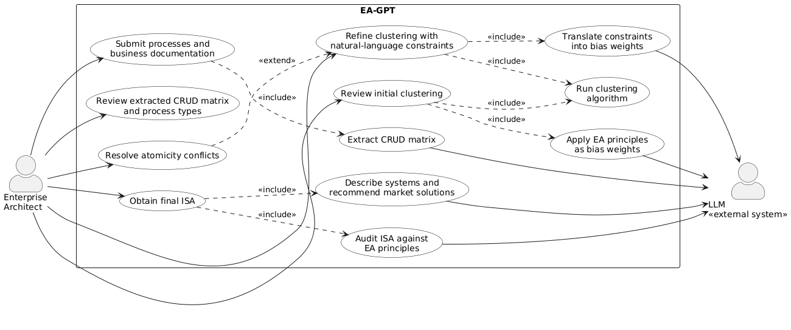
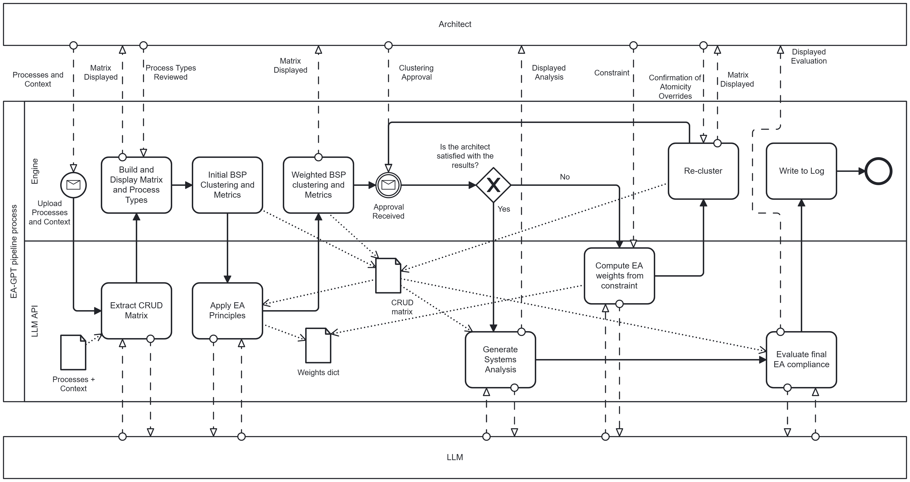
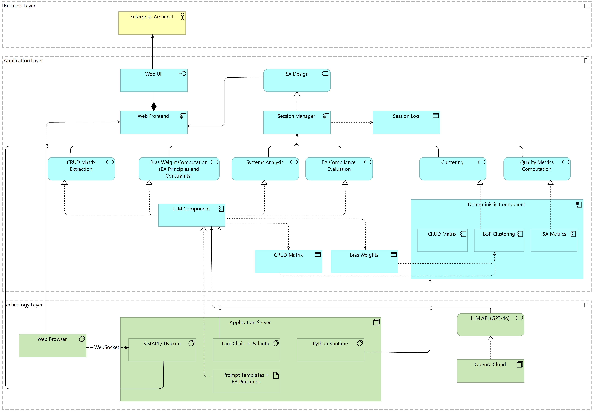

# EA-GPT

This repository contains the prototype developed for the MSc thesis
**"EA-gpt: using LLMs for Enterprise Architecture models' Generation from Principles and Text"**
(Instituto Superior Técnico, Universidade de Lisboa).

EA-GPT combines Large Language Models with IBM's Business System Planning (BSP) methodology
to support the design of an Information Systems Architecture (ISA). Given a list of business
processes and, optionally, supporting business documentation, it uses an LLM to extract a
CRUD matrix, clusters processes and data entities into candidate systems with a deterministic
BSP algorithm guided by EA principles, and lets the enterprise architect refine the result
with natural-language constraints. The final architecture is described system by system,
with build/buy/hybrid recommendations, and audited against the EA principles.

This is a research prototype, not a production tool.

## How it works

### Use cases

The enterprise architect submits processes and documentation, reviews the extracted CRUD
matrix and the initial clustering, refines it with constraints and obtains the final ISA.
The LLM is an external system used for extraction, weighting, description and auditing.



### Pipeline

1. **Extract CRUD matrix**: the LLM reads the processes and context and produces the CRUD
   matrix, classifying each process as `atomic` or `end_to_end`. The architect reviews the
   matrix and the process types.
2. **Initial BSP clustering**: the deterministic BSP algorithm clusters the matrix and
   computes ISA quality metrics.
3. **Apply EA principles**: the LLM turns the EA principles into bias weights, and the
   clustering is re-run with those weights.
4. **Refinement loop**: if the architect is not satisfied, they add a natural-language
   constraint. The LLM translates it into weights and the matrix is re-clustered. Overrides
   of atomicity constraints are always confirmed by the architect first.
5. **Systems analysis and compliance**: once the clustering is approved, the LLM describes
   each system, recommends market solutions and evaluates the final ISA against the EA
   principles. The session is written to a log.



### Architecture

The web frontend communicates with a FastAPI server over a WebSocket. The session manager
orchestrates two kinds of components:

- an **LLM component** (LangChain + Pydantic structured outputs, GPT-4o) for CRUD
  extraction, bias-weight computation, systems analysis and compliance evaluation;
- a **deterministic component** (plain Python) for the CRUD matrix, BSP clustering and
  ISA metrics.



### Code structure

```
src/
  app.py                 FastAPI + WebSocket server (entry point)
  static/index.html      Web frontend
  utils/
    matrix.py            CRUD matrix data structure and extraction schema
    bsp.py               BSP clustering algorithm and ISA metrics (deterministic)
    generator.py         LLM calls (extraction, weights, systems analysis, compliance)
  resources/             Prompt templates and baseline EA principles
tests/                   pytest suite for the deterministic BSP and ISA-metrics code
evaluation/              scripts for the thesis evaluation (Tests 2 and 3)
```

The scripts used in the thesis evaluation are in [evaluation/](evaluation/), which has its
own README.

## Setup and running

### Requirements

- Python 3.11 or newer (developed on 3.13)
- An OpenAI API key

### Installation

```bash
git clone https://github.com/sofiasimass/EA-GPT-thesis.git
cd EA-GPT-thesis
pip install -r requirements.txt
```

Create a `.env` file in the repository root with your API key:

```
OPENAI_API_KEY=your-key-here
```

### Running

```bash
cd src
python -m uvicorn app:app --port 8080
```

Then open http://localhost:8080 in your browser.

### Inputs

- **Process list**: comma-separated text, or a `.csv` with one process name per row.
- **Context document** (optional): a `.pdf` or `.txt` file, or pasted text. Without it, the
  LLM relies on its general knowledge of each process.
- **As-Is CRUD matrix** (optional, for an As-Is vs. To-Be comparison): a `.csv` with the
  columns `Process,Entity,Operation,System,ProcessType`, where `Operation` is one of
  `C/R/U/D` and `ProcessType` is one of `atomic/end_to_end/ambiguous`.

### Tests

The BSP algorithm and ISA metrics are deterministic and make no LLM calls, so the test
suite runs without an API key:

```bash
pytest
```
